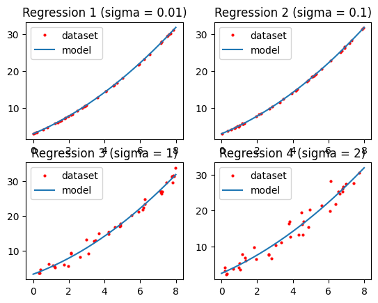

# Homework 1 (Programming Part)
Here is my solution to these programming problems, and I execute these programs on Google Colab. <br>

## Problems
1. **<i>Problem 10</i>**：
    - Suppose $y=3+2x+0.2x^2+n$ . And $n$ is a zero-mean Gaussian noise with variance $\sigma_N^2$ .
    - Suppose the predicted model is $\hat{y}(x, w_0, w_1)=w_0+w_1x+w_2x^2$ .
    - Write a program to determine the optimal weights when :
        1. $\sigma_N=0.01$
        2. $\sigma_N=0.1$
        3. $\sigma_N=1$
        4. $\sigma_N=2$
    - Please notice that :
        - Do not use built-in regression toolbox in the programming language you chose.
        - Uniformly (probability) generate a random variable $x$ in the range 0~8 , let $y=3+2x+0.2x^2+n$ .
        - Repeat procedure b. to get 40 pairs of $(x, y)$ as your own dataset.
        - Plot the regression function and data points on the same graph.


## Outputs
1. **<i>Solution to problem 10</i>**：
    <br>
    ```
    Regression 1 (sigma = 0.01):
    y = 0.2 * x^2  +  2.002 * x  +  2.994 

    Regression 2 (sigma = 0.1):
    y = 0.202 * x^2  +  1.993 * x  +  3.019 

    Regression 3 (sigma = 1):
    y = 0.212 * x^2  +  1.882 * x  +  3.25 

    Regression 4 (sigma = 2):
    y = 0.188 * x^2  +  2.173 * x  +  2.495
    ```
