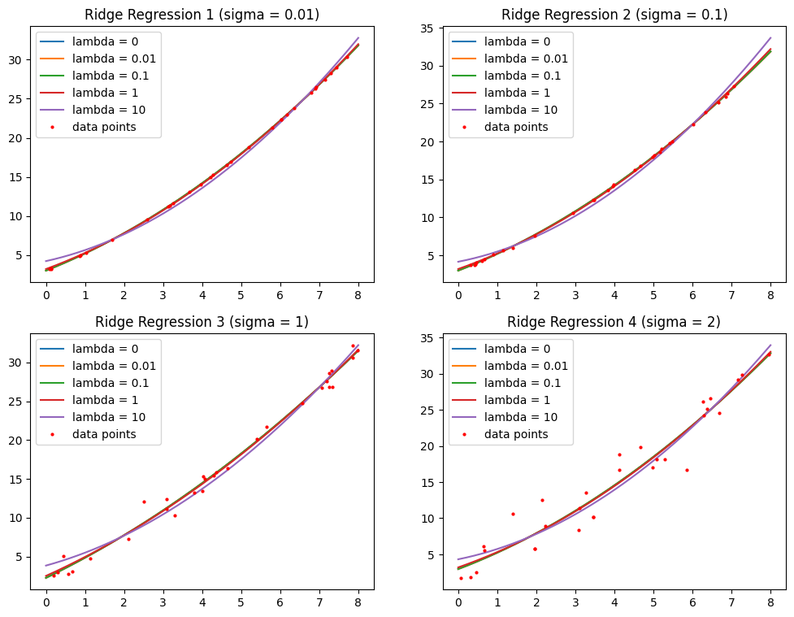
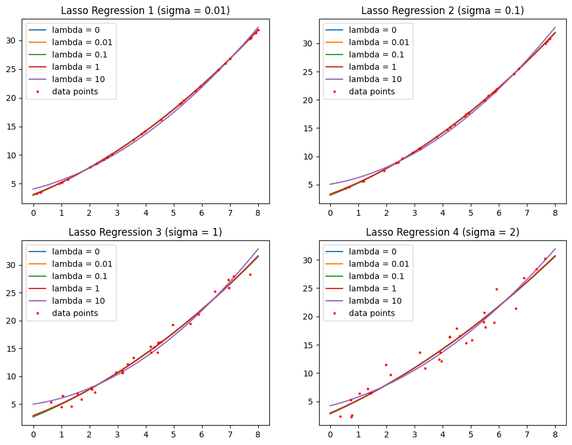

# Homework 2
Here are my solutions to the programming problems in Hw2. <br>

1. **<i>Problem 1</i>**：
    - Suppose we have the following dataset：

        | $x=(x_1, x_2)$ | $(1, 1)$ | $(1, 3)$ | $(5, 2)$ | $(7, 4)$ | $(9, 2)$ |
        |     :----:     |  :----:  |  :----:  |  :----:  |  :----:  |  :----:  |
        |      $y$       |   $2$    |   $5$    |   $3$    |   $4$    |   $8$    |

    - use Ridge to determine the best predicted model when
        <br>$\hat{y}(x, \mathbf{w}) = w_0 + w_1x_1 + w_2x_2$
    - use Lasso to determine the best predicted model when
        <br>$\hat{y}(x, \mathbf{w}) = w_0 + w_1x_1 + w_2x_2$
    - Write your own program and don’t use the toolboxes of Ridge and Lasso.
    <br><br>

    **<i>My Solution's Result</i> (outputs of "problem_01.py")**：
    <br>
    ```
    >> Least Square Linear Regression :
    Optimal weights = [2.42763158 0.40131579 0.05263158]

    >> Ridge Regression :
    Optimal weights (lambda=0) = [2.42763158 0.40131579 0.05263158]
    Optimal weights (lambda=0.01) = [2.42763158 0.40131579 0.05263158]
    Optimal weights (lambda=0.1) = [2.42763158 0.40131579 0.05263158]
    Optimal weights (lambda=1) = [2.46839654 0.39387891 0.0499002 ]
    Optimal weights (lambda=10) = [2.75837743 0.33686067 0.03835979]

    >> Lasso Regression :
    Optimal weights (lambda=0) = [2.42763158 0.40131579 0.05263158]
    Optimal weights (lambda=0.01) = [2.43228618 0.40129934 0.05072368]
    Optimal weights (lambda=0.1) = [2.47417763 0.40115132 0.03355263]
    Optimal weights (lambda=1) = [2.62109375 0.38671875 0.        ]
    Optimal weights (lambda=10) = [3.4296875 0.2109375 0.       ]
    ```
    ( I write two functions to implement Ridge Regression, but I only used one. )<br><br>

2. **<i>Problem 2</i>**：
    - Suppose $y = 3 + 2x + 0.2x^2 + n$ in which $n$ is a zero-mean Gaussian noise with variance $\sigma_N^2$ .
    - Suppose the predicted model is $\hat{y}(x, \mathbf{w})=w_0+w_1x+w_2x^2$ .
    - Write a program to determine the optimal weights when :
        1. $\sigma_N=0.01$
        2. $\sigma_N=0.1$
        3. $\sigma_N=1$
        4. $\sigma_N=2$
    - Procedure to generate your own dataset :
        1. Uniformly generate a random variable between 0 and 8 and let this be $x$ .
        2. Generate a zero-mean Gaussian noise with variance $\sigma_N$ and let this be $n$ .
        3. Use this procedure to have a dataset containing 30 pairs of $x$ and $y$ .
    <br><br>

    **<i>My Solution's Result</i> (outputs of "problem_02.py")**：
    <br>
    ```
    Ridge Regression 1 (sigma = 0.01):
    y = 3.011 + 1.995*x + 0.2*x^2  (lambda = 0)
    y = 3.013 + 1.994*x + 0.201*x^2  (lambda = 0.01)
    y = 3.033 + 1.979*x + 0.202*x^2  (lambda = 0.1)
    y = 3.219 + 1.842*x + 0.219*x^2  (lambda = 1)
    y = 4.234 + 1.099*x + 0.309*x^2  (lambda = 10)

    Ridge Regression 2 (sigma = 0.1):
    y = 2.982 + 2.016*x + 0.199*x^2  (lambda = 0)
    y = 2.985 + 2.014*x + 0.199*x^2  (lambda = 0.01)
    y = 3.006 + 1.995*x + 0.202*x^2  (lambda = 0.1)
    y = 3.202 + 1.826*x + 0.225*x^2  (lambda = 1)
    y = 4.16 + 1.004*x + 0.335*x^2  (lambda = 10)

    Ridge Regression 3 (sigma = 1):
    y = 2.242 + 2.447*x + 0.152*x^2  (lambda = 0)
    y = 2.245 + 2.445*x + 0.152*x^2  (lambda = 0.01)
    y = 2.27 + 2.429*x + 0.154*x^2  (lambda = 0.1)
    y = 2.506 + 2.271*x + 0.171*x^2  (lambda = 1)
    y = 3.837 + 1.387*x + 0.27*x^2  (lambda = 10)

    Ridge Regression 4 (sigma = 2):
    y = 2.964 + 2.061*x + 0.209*x^2  (lambda = 0)
    y = 2.966 + 2.06*x + 0.209*x^2  (lambda = 0.01)
    y = 2.99 + 2.043*x + 0.211*x^2  (lambda = 0.1)
    y = 3.202 + 1.892*x + 0.229*x^2  (lambda = 1)
    y = 4.323 + 1.099*x + 0.325*x^2  (lambda = 10)
    ```

 <br><br>


2. **<i>Problem 3</i>**：
    - Suppose $y = 3 + 2x + 0.2x^2 + n$ in which $n$ is a zero-mean Gaussian noise with variance $\sigma_N^2$ .
    - Suppose the predicted model is $\hat{y}(x, \mathbf{w})=w_0+w_1x+w_2x^2$ .
    - Write a program to determine the optimal weights when :
        1. $\sigma_N=0.01$
        2. $\sigma_N=0.1$
        3. $\sigma_N=1$
        4. $\sigma_N=2$
    - Procedure to generate your own dataset :
        1. Uniformly generate a random variable between 0 and 8 and let this be $x$ .
        2. Generate a zero-mean Gaussian noise with variance $\sigma_N$ and let this be $n$ .
        3. Use this procedure to have a dataset containing 30 pairs of $x$ and $y$ .
    <br><br>

    **<i>My Solution's Result</i> (outputs of "problem_02.py")**：
    <br>
    ```
    Lasso Regression 1 (sigma = 0.01):
    y = 3.002 + 1.999*x + 0.2*x^2  (lambda = 0)
    y = 3.003 + 1.998*x + 0.2*x^2  (lambda = 0.01)
    y = 3.013 + 1.992*x + 0.201*x^2  (lambda = 0.1)
    y = 3.109 + 1.926*x + 0.208*x^2  (lambda = 1)
    y = 4.069 + 1.269*x + 0.282*x^2  (lambda = 10)

    Lasso Regression 2 (sigma = 0.1):
    y = 3.106 + 1.952*x + 0.205*x^2  (lambda = 0)
    y = 3.107 + 1.95*x + 0.205*x^2  (lambda = 0.01)
    y = 3.125 + 1.94*x + 0.206*x^2  (lambda = 0.1)
    y = 3.3 + 1.841*x + 0.217*x^2  (lambda = 1)
    y = 5.053 + 0.847*x + 0.328*x^2  (lambda = 10)

    Lasso Regression 3 (sigma = 1):
    y = 2.741 + 2.072*x + 0.19*x^2  (lambda = 0)
    y = 2.744 + 2.071*x + 0.19*x^2  (lambda = 0.01)
    y = 2.764 + 2.059*x + 0.191*x^2  (lambda = 0.1)
    y = 2.968 + 1.94*x + 0.205*x^2  (lambda = 1)
    y = 5.01 + 0.746*x + 0.342*x^2  (lambda = 10)

    Lasso Regression 4 (sigma = 2):
    y = 2.829 + 2.248*x + 0.153*x^2  (lambda = 0)
    y = 2.83 + 2.247*x + 0.153*x^2  (lambda = 0.01)
    y = 2.843 + 2.239*x + 0.154*x^2  (lambda = 0.1)
    y = 2.971 + 2.151*x + 0.165*x^2  (lambda = 1)
    y = 4.249 + 1.273*x + 0.273*x^2  (lambda = 10)
    ```
    



( I use Google Colab to execute my programs )
